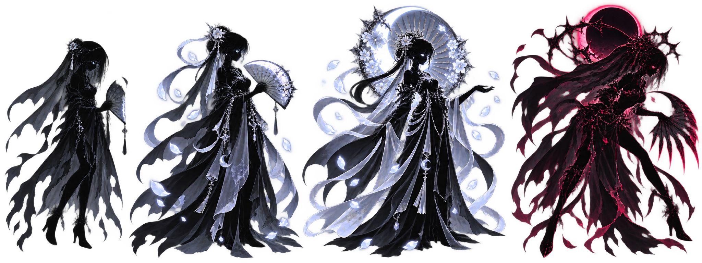
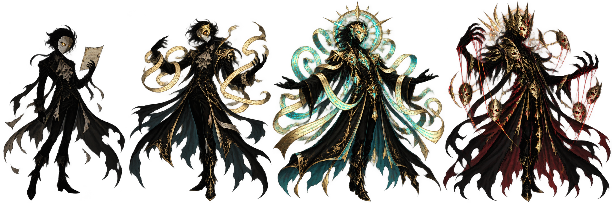
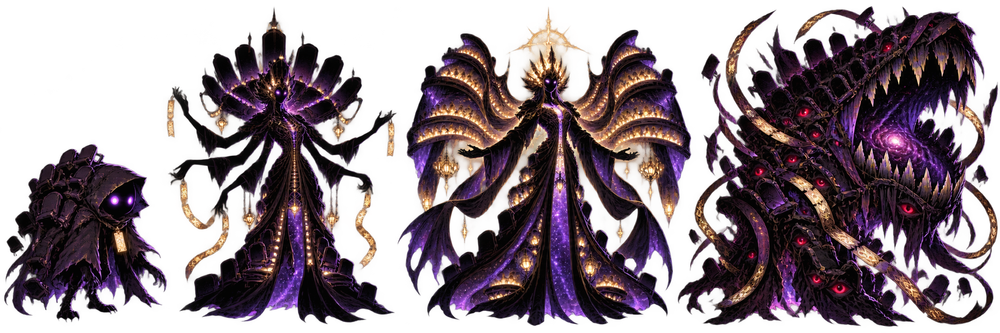

# 전설·보스 기억 성장 1차 묶음

180종 전체 성장 제작의 기준이 되는 고급 등급 샘플이다. 단계는 `잔영 → 기억 복원 → 진명 각성`이며,
진명은 구원과 원한 중 하나를 선택한다. 따라서 한 종이 사용하는 외형은 최대 4개다.

## 달빛의 미망인 — 지역 보스

| 단계 | 이름 | 전투 방향 |
|---|---|---|
| 잔영 | 달빛의 미망인 | 공격 감소와 빙결을 사용하는 서리 지원가 |
| 기억 복원 | 월화의 상주 | 내구와 회피가 오르고 `꽃잎 진혼곡` 해금 |
| 구원 진명 | 월백화 연화 | 높은 방어와 자가 회복을 갖춘 장기전 수호자 |
| 원한 진명 | 식월귀 연화 | 치명타·속도·출혈에 집중한 공격형 마도사 |

프롤로그 지역 보스이므로 전투 중 포획할 수 없다. `BossEncounterTrigger.purificationReward`에 이
ShadowData를 연결하면 승리 직후 정화된 개체가 파티 또는 각본 서고에 합류한다.

## 최초의 배우 — 전설

| 단계 | 이름 | 전투 방향 |
|---|---|---|
| 잔영 | 최초의 배우 | 방어 약화와 고화력 무속성 마법 |
| 기억 복원 | 기억의 비극배우 | 속도 약화와 치명타 강화 |
| 구원 진명 | 이야기의 수호자 아델 | 균형 잡힌 능력치와 강력한 회복 |
| 원한 진명 | 가면왕 아델 | 최고 수준의 공격·속도와 공격 감소 궁극기 |

## 마지막 관객 — 전설

| 단계 | 이름 | 전투 방향 |
|---|---|---|
| 잔영 | 마지막 관객 | 높은 HP·방어와 공격 약화 |
| 기억 복원 | 별길의 검표원 | 자가 회복을 얻는 순수 탱커 |
| 구원 진명 | 기억의 관람석 에스카 | 최고 내구와 피해·약화·회복을 겸하는 수호자 |
| 원한 진명 | 포식극장 에스카 | 내구 일부를 공격력과 출혈 화력으로 전환 |

## Unity 데이터 생성

1. 메뉴 `Tools > Shadow Theater > Generate Legendary Growth Batch` 실행
2. 성장 시트를 각각 4개의 Sprite로 자동 분할
3. `Assets/Data/Generated/Skills`에 전용 스킬 18개 생성
4. `Assets/Data/Generated/Shadows`에 ShadowData 3개 생성
5. 생성 결과를 `Resources/ShadowDatabase.asset`에 ID 중복 없이 자동 등록

원본 밸런스와 Lore는 `Assets/Resources/Data/LegendaryGrowthCatalog.json`에서 수정한다. 생성 메뉴는
동일 ID 에셋을 갱신하므로 수치를 수정한 뒤 다시 실행해도 중복 에셋이 생기지 않는다.

## 180종 차등 제작 기준

- `Standard`: 동일 실루엣을 기반으로 포인트 컬러, 오라, 소품과 스킬 FX 중심 변화
- `Rare`: 기억 복원부터 무기·신체 일부가 달라지고 진명에서 큰 실루엣 변화
- `RegionalBoss`: 네 형태 모두 별도 실루엣, 전용 궁극기와 개인 비극 퀘스트 제공
- `Legendary`: 구원/원한이 완전히 다른 실루엣·역할·Lore 결말을 갖도록 제작
