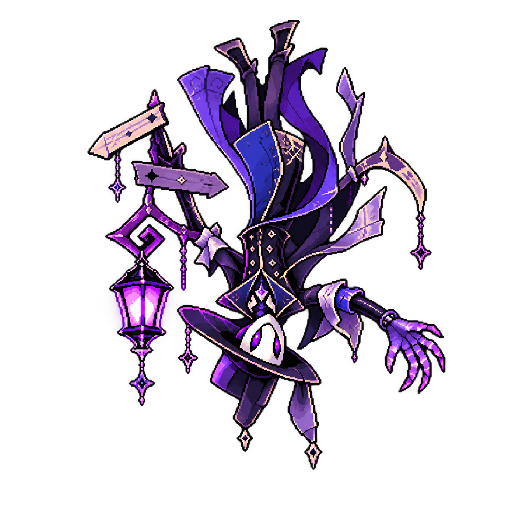
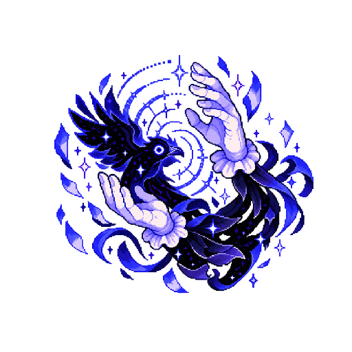
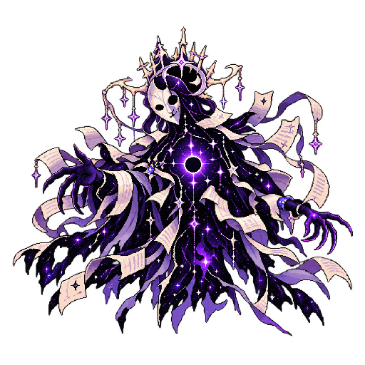

# 그림자 극장 잔영 (Shadow Theater)

1인 개발 2D 모바일 RPG — 스토리 중심 타일맵 필드 탐색 + 1대1 수집형 턴제 전투 (Unity 2D URP).

| 폴더 | 내용 |
|---|---|
| `Assets/Scripts/Data` | ShadowData / SkillData / ItemData (ScriptableObject), ShadowInstance, ShadowDatabase |
| `Assets/Scripts/Battle` | BattleManager(턴 상태 머신), BattleUnit, DamageCalculator, BattleAI, IBattlePresenter |
| `Assets/Scripts/Save` | SaveData(JSON), SaveManager, 파티·각본 서고 편성 API |
| `Assets/Scripts/Field` | PlayerController(타일 이동), EncounterSymbol(심볼 인카운터), GameFlowController(필드↔전투) |
| `Assets/Scripts/Story` | JSON 대사/퀘스트/40개 지역 저장소, 목표 추적, 누적 선택 기반 다중 엔딩 |
| `Assets/Scripts/UI` | 모바일 대화창, 퀘스트 HUD, 월드맵, 정착지 상점, 필드 저장 메뉴, 스타터 선택, 각본집 도감, 파티·서고 편성, 전역 설정 |
| `Assets/Editor` | 주요 모바일 UI 프리팹 자동 생성 메뉴 |
| `Prototype/shadow-theater.html` | 같은 전투 규칙의 브라우저 프로토타입 — 더블클릭으로 실행, 밸런스 데이터 편집 탭 포함 |
| `Docs/` | 기획 명세서, 씬 세팅 가이드(SETUP.md) |

## 집 PC에서 Unity로 열기
1. 이 저장소를 clone
2. Unity Hub → **Add project from disk** → clone한 폴더 선택
3. 기준 버전인 **Unity 2022.3.21f1** 또는 같은 2022.3 LTS 계열로 열기
4. 첫 실행 시 `Packages/manifest.json`을 기준으로 URP 2D, Tilemap Extras, Input System 등을 자동 설치
5. Player Settings → Active Input Handling = **Both** 확인
6. Unity가 생성한 나머지 `ProjectSettings/`, `Packages/packages-lock.json`, `*.meta` 파일까지 커밋

처음 열 때 Safe Mode가 표시되면 진입해 Console의 첫 오류부터 확인합니다. `ENOSPC`가 보이면 코드
문제가 아니라 디스크 용량 부족이므로 Unity를 종료하고 프로젝트의 `Library`와 로컬 Unity 패키지
캐시를 지운 뒤 충분한 공간에서 다시 가져옵니다. URP가 제공하는 동명 타입과 게임의 `ShadowData`가
충돌하지 않도록 에디터 생성기는 게임 데이터 타입 별칭을 명시합니다.

타이틀은 현재 저장의 지역·플레이 시간·파티 인원을 표시합니다. 기존 저장이 있을 때 `새로운 기억`을 누르면
덮어쓰기 확인창이 먼저 열리고, 취소하면 어떤 데이터도 변경하지 않습니다. 이어하기 실패는 저장 없음,
주 파일과 백업 모두 손상, 더 최신 게임 버전에서 생성된 저장, 저장 지역 씬 누락을 구분해 안내합니다.
주 파일만 손상된 경우에는 `.bak` 복구 사실을 표시한 뒤 정상적으로 이어갈 수 있습니다.

## 초반 콘텐츠 데이터 빠른 설치
1. Unity 메뉴 **Tools → Shadow Theater → Generate Core Content Data** 실행
2. `Assets/Data/Generated`에 생성된 핵심 그림자 177종, 스킬 142개, 도구 8개 확인
3. `Resources/ShadowDatabase.asset`에 모든 데이터가 자동 등록되었는지 확인

기본 카탈로그와 제2~8막 콘텐츠 팩을 자동 병합합니다. 스타터 3종과 주요 그림자는 기억 복원·구원·원한
성장 데이터를 포함합니다. 실제 전용 이미지가
아직 없는 개체에는 기능 테스트용 실루엣 PNG를 자동 생성하며, 이후 완성 아트로 교체해도 ID와 세이브는
그대로 유지됩니다. 생성기는 기존 80종에 지역 로스터 97종을 더하고, 전설 성장 3종까지 실행하면
총 180종이 됩니다. 97종은 40개 필드에 실제 심볼 인카운터로 배치되며 레벨·희귀도·포획률·스킬·Lore를
각 지역 설정에서 결정합니다. 상세 규칙은 [`Docs/SHADOW_ROSTER_180.md`](Docs/SHADOW_ROSTER_180.md)를
참고하세요.

## 플레이 가능한 프롤로그 자동 생성
1. Unity 메뉴 **Tools → Shadow Theater → Generate Playable Prologue** 실행
2. 현재 씬 저장 여부를 확인하면 필요한 데이터·UI 프리팹과 프롤로그 씬을 일괄 생성
3. 생성 후 자동으로 열린 `Title` 씬에서 Play

생성되는 동선은 `Title → 잔향 극장 → 잔향 마을 → 달빛 초원 → 달빛 보스 무대 → 찢어진 장막길 →
재의 국경 → 불씨 성도 → 무너진 병영/불씨 지하묘 → 왕관 없는 옥좌 → 서리 나루 → 백색 기록원 →
금단의 서가 → 거울 문고 → 푸른 심연 서고 → 자줏빛 늪 → 울음 마을 → 월아 숲 → 핏빛 달고개 →
잠든 야수의 굴 → 실타래 시장 → 태엽 골목 → 마리오네트 오페라 → 끊어진 공방 → 인형사의 대무대 →
지워진 역 → 백지 감옥 → 먹칠 연구소 → 침묵 재판정 → 검은 기록원 → 유리 해안 → 기억의 바다 →
미망인의 월궁 → 뒤집힌 로비 → 끝없는 무대 뒤 → 최초 배우의 분장실 → 우주의 객석 → 마지막 장막`으로
이어집니다. 각 필드는
23×19 타일의 개방형 구조이며 상하좌우 탐색, 장애물 우회, 모바일 방향키/A 버튼, NPC 대화, 퀘스트,
심볼 인카운터, 각본 기록, 지역 보스 정화와 분기 엔딩까지 한 흐름으로 확인할 수 있습니다. 41개 씬은 Build Settings에
자동 등록됩니다.

각 필드 우상단의 `메뉴`에서는 현재 지역·플레이 시간·금화를 확인하고 수동 저장할 수 있습니다. 전체/음악/
환경음/효과음은 플레이 중 즉시 조절되며, 타이틀 복귀는 확인 창을 거쳐 현재 위치를 저장한 다음 실행됩니다.
전투·대화·각본집·파티·월드맵이 열린 동안에는 중복으로 열리지 않습니다. 자세한 내용은
[`Docs/FIELD_PAUSE_MENU.md`](Docs/FIELD_PAUSE_MENU.md)를 참고하세요.
Android 뒤로가기와 PC Escape는 현재 열린 퀘스트 기록장·도구 가방·상점·월드맵·파티·각본집을 먼저
닫고, 열린 화면이 없을 때만 필드 메뉴를 여는 일관된 뒤로가기 동작을 사용합니다.
지역 이동·전투 결과·퀘스트 진행 등 자동 저장이 끝나면 우상단에 `기억을 기록했습니다`가 짧게 표시됩니다.
지역 카탈로그에서 `isSettlement`로 지정된 거점에 도착하면 그 위치가 자동 체크포인트가 되어, 이후 전투에서
패배해도 직전 거점으로 복귀합니다.
맵 업데이트로 기존 저장 좌표나 체크포인트가 새 절벽·물·벽 또는 맵 바깥에 놓인 경우에는 주변의 가장 가까운
이동 가능 타일을 찾아 자동 복구합니다. 바닥 타일이 없는 영역은 이동할 수 없으며, 전체 검증은 40개 지역의
월드맵 도착 좌표, 모든 포털의 대상 씬 도착 좌표와 바닥/충돌 Tilemap 연결까지 검사해 잘못된 입구가
출시되는 것을 막습니다.
플레이 도중 장식물이나 심볼 배치 사이에 갇혔을 때는 `메뉴 → 안전 위치 복귀`로 현재 지역 체크포인트 또는
직전 거점의 유효한 타일로 이동할 수 있으며, 복귀 좌표는 즉시 저장됩니다.
포획 직후에는 새 그림자가 파티에 합류했는지, 파티가 가득 차 각본 서고로 이동했는지 이름과 함께 알려줍니다.
지역·전설 보스 정화 보상도 동일한 합류/서고 알림을 표시해 보상 그림자가 사라진 것처럼 보이지 않습니다.
필드 `메뉴 → 파티 편성 · 각본 서고`에서 보유 그림자를 확인하고 파티 이동과 출전 순서를 변경할 수 있습니다.
기존 세이브에서 도감에는 기록됐지만 보유 목록에서 누락된 그림자도 이어하기 시 파티 또는 각본 서고로 자동 복구합니다.
거점 지역에서는 상단의 `상점` 버튼이 표시됩니다. 전투와 퀘스트로 얻은 금화로 회복 시약·열기 토닉·
특수 잉크·정화 연고를 구매하거나 보유 도구를 판매할 수 있고, 모든 거래는 즉시 저장됩니다. 파티 화면에서
상처 입은 그림자를 고른 뒤 `회복`을 누르면 보유한 필드용 회복 도구 중 낭비가 가장 적은 하나를 자동으로
사용합니다. 기절한 그림자는 도구로 되살릴 수 없으며 정착지 체크포인트 복귀로 회복해야 합니다.
상점의 `막간 휴식`은 30금화를 소비해 기절 상태를 포함한 파티 전원을 완전히 회복하므로, 던전 출발 전에
파티를 정비하는 별도의 재화 소비처로 동작합니다.
상점 물품은 1~8막 진행도에 따라 단계적으로 해금됩니다. 1막에는 작은/일반 회복 시약과 토닉·연고,
3막에는 농축 회복 시약, 4막에는 FP 4 영약, 5막에는 기록 확률 2.5배 은빛 잉크가 추가됩니다.
콘텐츠 생성기는 8종 도구의 ID 중복, 효과 타입, 구매/판매 가격과 해금 막 범위를 에셋 생성 전에 검사합니다.
또한 회복·FP·기록·정화 효과를 색으로 구분한 64×64 픽셀 병 아이콘을 자동 생성해 상점과 도구 가방에 표시합니다.
필드 `메뉴 → 도구 가방`에서는 현재 보유 도구와 수량, 필드 사용 가능 여부를 확인합니다. 도구와 파티원을
각각 선택해 회복 시약을 직접 사용할 수 있으며, HP가 가득 찼거나 기절한 대상·전투 전용 도구는 사용 버튼이
비활성화됩니다. 성공한 사용 결과는 즉시 세이브됩니다.
퀘스트는 금화뿐 아니라 도구 묶음도 보상할 수 있습니다. 초반 `첫 번째 배역` 완료 시 특수 잉크 2개,
달빛 초원 보스 완료 시 회복 시약 3개를 지급하며, 퀘스트 HUD가 금화와 도구 보상을 함께 표시합니다.
목표를 모두 달성하면 화면 중앙에 퀘스트명과 실제 지급된 금화·도구를 표시하는 `기억 완료` 알림이 나타납니다.
이어하기 때는 완료 퀘스트에서 다음 퀘스트가 누락된 구버전 저장, 이미 대화·지역 방문·보스 처치를 끝냈지만
목표 수치가 남지 않은 중단 저장을 자동 복구합니다. 보스 승리 대사 도중 앱이 종료되어도 재입장 시 정화 보상과
출구/막 완료 플래그를 다시 확정하므로, 사라진 보스 뒤에서 다음 지역이 영구 잠기는 상황을 방지합니다.
잠긴 포털에 닿으면 현재 진행해야 할 기억 여정의 이름을 HUD로 안내합니다.
필드 `메뉴 → 기억 여정`은 시작된 퀘스트를 진행 중/완료 기록으로 나눠 보여 줍니다. 각 기록의 줄거리,
목표별 달성 상태, 완료 보상과 수령 여부를 다시 확인할 수 있어 40개 지역 장편 진행 중에도 이전 이야기를
놓치지 않도록 했습니다.
일반·라이벌·보스 전투에서 승리하면 상대 그림자의 희귀도와 역할에 따라 회복 시약, 열기 토닉,
특수 잉크, 정화 연고가 확률적으로 떨어집니다. 획득한 전리품은 결과 창에 표시된 뒤 인벤토리에 저장되며,
전설 그림자는 더 높은 확률로 특수 잉크 1~2개를 남깁니다.
전투 도구 목록은 현재 상태를 검사해 낭비 사용을 차단합니다. HP/FP가 가득 찬 경우, 해제할 상태 이상이
없는 경우, 기록 불가 전투에서 잉크를 선택한 경우에는 버튼이 비활성화되고 정확한 이유가 표시됩니다.

제2막에는 그림자 10종과 스킬 20개, 메인 퀘스트 5개, 선택 분기, 지역 보스 2종과 전설 보스
`재의 왕`이 포함됩니다. 전체 구성은 [`Docs/ACT2_CROWN_OF_ASH.md`](Docs/ACT2_CROWN_OF_ASH.md)를
참고하세요.

제3막에는 신규 그림자 10종과 스킬 20개, 메인 퀘스트 5개, 거울 문고 선택 분기, 지역 보스
`책 먹는 용`·`반전된 사서`와 전설 보스 `무한서고의 용`이 포함됩니다. 전체 구성은
[`Docs/ACT3_FORBIDDEN_ARCHIVE.md`](Docs/ACT3_FORBIDDEN_ARCHIVE.md)를 참고하세요.

제4막에는 신규 그림자 10종과 스킬 20개, 메인 퀘스트 5개, 울음 마을 선택 분기, 지역 보스
`붉은 뿔의 추격자`와 전설 보스 `밤을 삼킨 짐승`이 포함됩니다. 전체 구성은
[`Docs/ACT4_NIGHT_OF_BEASTS.md`](Docs/ACT4_NIGHT_OF_BEASTS.md)를 참고하세요.

최종막에는 뒤집힌 로비부터 마지막 장막까지 5개 필드, 전용 그림자 13종·스킬 12개, 성장 전설
`최초의 배우`·`마지막 관객`, 또 다른 연출가의 마지막 선택과 4종 분기 엔딩 진입이 포함됩니다. 전체
구성 및 달빛 초원 출구 수정은 [`Docs/ACT8_FINAL_THEATER.md`](Docs/ACT8_FINAL_THEATER.md)를 참고하세요.
`Assets/Art/Final/Portraits`에 있는 거꾸로 안내원·침묵의 박수·각본 밖의 그림자 완성 초상은 데이터 생성 시
자동 실루엣보다 우선 적용됩니다. 512×512 투명 PNG, Point 필터, 밉맵 비활성 설정도 생성기가 보장합니다.

| 거꾸로 안내원 | 침묵의 박수 | 각본 밖의 그림자 |
|---|---|---|
|  |  |  |
| 등불이 뒤따르는 2보 보행 | 손 펼침·합장 날갯짓 | 장막과 투명도가 어긋나는 위상 이동 |

Unity 메뉴 **Tools → Shadow Theater → Preview Final Shadow Art**를 열면 스토리를 진행하지 않아도 세 전투
초상과 실제 24×32 필드 2프레임을 애니메이션으로 비교하고, 생성된 `ShadowData`를 바로 선택할 수 있습니다.
스타터 3종의 필드 프레임은 초상을 단순 축소한 이미지가 아니라 제한 팔레트와 굵은 실루엣으로 다시 그린
전용 도트입니다. 기사에게는 검·망토 보행, 마도사에게는 모자·머리카락 부유, 야수에게는 앞발·꼬리
달리기 변화가 들어가며 32 PPU 타일 위에서 두 프레임을 반복합니다.

최종 픽셀 아트는 자동 생성 파일을 직접 덮어쓰지 않습니다. `Assets/Art/Final` 아래에 규격과 파일명을
맞춰 넣으면 전체 생성 과정이 전투 초상, 그림자 2프레임, 주인공 6프레임, 지역 타일을 우선 사용합니다.
현재 교체율과 잘못된 크기·파일명은 `FinalArtCoverage.json`과 전체 회귀 검증에서 확인할 수 있습니다.
자세한 규칙은 [`Docs/FINAL_PIXEL_ART_PIPELINE.md`](Docs/FINAL_PIXEL_ART_PIPELINE.md)를 참고하세요.

현재 저장소에는 극단주 방향별 보행 6프레임과 스타터 3종, 아리아/등불지기 및 프롤로그 야생 그림자,
제2막 초반 그림자까지 핵심 10종의 컬러 초상·필드 프레임이 실제 PNG로 포함되어 있습니다. 전체 생성 시
임시 도형보다 이 파일을 우선 연결하며, 핵심 파일이 빠지면 회귀 검증이 실패하도록 보호합니다.

전투의 `교체` 화면은 현재 출전 중인 그림자를 제외한 파티원을 표시하며, 기절한 파티원은 비활성 상태로
HP와 함께 표시합니다. 비활성 UI 템플릿을 복제한 후보가 보이지 않던 문제를 수정했고, 필드의 `파티`
화면도 포획 직후 파티·각본 서고 목록의 레이아웃을 즉시 다시 계산합니다.
전투 패널에는 양쪽의 최대 6인 파티 스트립도 표시됩니다. 밝은 슬롯은 현재 출전 중인 그림자, HP 색상은
생존 상태, 어두운 덮개는 기절 상태를 나타내므로 교체 버튼을 열기 전에도 남은 전력을 확인할 수 있습니다.
라이벌·보스 AI와 플레이어 자동 전투는 현재 그림자의 HP가 위험하거나 속성이 명확히 불리할 때 더 건강하고
상성이 나은 파티원으로 교체합니다. 같은 유닛을 반복해서 내보내는 현상을 막기 위해 자발적 교체 뒤에는
3턴의 판단 쿨다운이 적용되며, 야생 그림자는 임의로 교체하지 않습니다.
적 그림자 한 명을 쓰러뜨릴 때마다 그 적을 상대로 실제 무대에 올랐던 생존 파티원들이 경험치를 균등하게
나눠 받습니다. 중간에 교체된 그림자도 참여자로 유지되며, 기절한 그림자는 해당 적의 경험치를 받지 않습니다.
라이벌처럼 여러 그림자를 쓰는 전투에서는 적이 새로 등장할 때 참여 기록도 현재 출전 그림자부터 다시 셉니다.
그림자의 최대 레벨은 100이며, 파티·각본 서고 카드와 전투 교체 목록에서 현재 경험치와 다음 레벨 요구량을
확인할 수 있습니다. 최대 레벨에서는 `EXP MAX`로 표시되고 추가 경험치는 누적되지 않습니다.
기술은 FP 비용과 위력 단계에 따라 기본적으로 Lv.1·5·12·20에 순차 해금되며, 콘텐츠 JSON의
`requiredLevel` 값으로 개별 조정할 수 있습니다. 레벨업으로 새 기술이 열리면 전투 결과 메시지로 알려주고,
기억 복원·진명 각성 전용 기술은 해당 성장 단계 조건까지 함께 만족해야 사용할 수 있습니다.
전투의 `각본 기록` 버튼에는 적의 현재 HP, 상태 이상, 특수 잉크 보정을 반영한 성공률이 실시간 표시됩니다.
특수 잉크 보정은 다음 기록 시도 한 번에만 소비되며, 기록 불가 그림자는 버튼에서 즉시 구분됩니다. 공격
메시지에는 실제 피해량과 치명타, 속성 상성의 강함·약함도 함께 표시됩니다.
양쪽 전투 패널은 빙결·화상·출혈뿐 아니라 공격/방어/속도 감소를 동시에 표시하며, 각 효과 옆의 `T` 숫자로
남은 지속 턴을 알려줍니다. 도구로 상태를 정화하거나 턴이 만료되면 패널도 즉시 갱신됩니다.
이름 아래에는 붉은 불꽃·푸른 서리·자줏빛 그림자·무속성을 전용 색상으로 표시해 상성을 바로 판단할 수 있습니다.
기술 선택 목록은 FP 외에도 위력·명중률·공격 속성·현재 적에 대한 1.5배/0.75배 상성, 회복 비율,
상태 이상 확률과 지속 턴, 필살기 여부를 표시합니다.
적 AI와 자동 전투는 이미 적용된 동일 상태 이상을 다시 거는 행동의 우선도를 낮추고, 공격이나 다른 유효한
기술을 선택합니다. 주요 상태 이상이 이미 있는 경우에도 중복 불가능한 주요 상태 기술을 낭비하지 않습니다.
기술 판단은 표시 계수만 비교하지 않고 현재 공격력·상대 방어력·속성 상성·치명타 기대값으로 평균 피해를
계산합니다. 이번 공격으로 쓰러뜨릴 수 있는 기술과 HP가 위험할 때의 회복은 우선하며, 필살기는 기대 피해가
지나치게 낮은 대상에게 낭비하지 않습니다. 전체 검증은 FP 비용, 명중률, 피해/회복 계수, 기본 능력치,
기록 확률과 등급별 성장 형태 누락도 함께 검사합니다.
보스 전투는 HP 50% 이하에서 2페이즈로 전환됩니다. 전환 메시지와 함께 적 FP가 2 증가하고, 회복 가능
범위와 공격·상태 이상·필살기 우선도가 높아집니다. 다수의 보스를 상대하는 전투에서는 각 적이 자신의
2페이즈를 한 번만 발동합니다.

대화 데이터의 감정 태그도 실제 연출에 반영됩니다. 분노·경고는 붉은 강조와 짧은 흔들림, 공포·미스터리는
푸른 긴장감, 희망·안도는 금빛 맥동, 슬픔은 낮은 청보라색, 결의는 강한 자주색으로 대화창·화자·본문 색과
움직임이 달라집니다. 따라서 기존 대사 시퀀스의 감정 정보가 별도 컷신 제작 전에도 장면의 분위기를
구분합니다.
필드에 들어오면 현재 막 제목·지역명·환경을 표시하는 비차단 지역 타이틀 카드가 나타납니다. 40개 지역의
기존 카탈로그와 번역 키, 지역 포인트 컬러를 그대로 사용하며 이동이나 전투 입력을 막지 않습니다.

제5막에는 신규 그림자 10종과 스킬 20개, 메인 퀘스트 5개, 끊어진 공방 선택 분기, 지역 보스
`줄 위의 프리마돈나`와 전설 보스 `마지막 인형사`가 포함됩니다. 전체 구성은
[`Docs/ACT5_PUPPET_CITY.md`](Docs/ACT5_PUPPET_CITY.md)를 참고하세요.

제6막에는 신규 그림자 10종과 스킬 12개, 메인 퀘스트 5개, 원한 기록 처리 선택 분기와 보스
`제0호 간수`·`추출 실험체 M`·`무언의 재판장`, 전설 보스 `대검열관 노크스`가 포함됩니다.
[`Docs/ACT6_BLACK_CENSORS.md`](Docs/ACT6_BLACK_CENSORS.md)를 참고하세요.

각 필드에는 지역별 Sprite-Lit 재질, 글로벌 라이트와 3~5개의 포인트 조명이 생성됩니다. 픽셀 가장자리를
선명하게 유지하기 위해 기존 안개·빛가루 레이어와 포스트 프로세싱은 필드에서 비활성화됩니다. 제2막은
붉은 재폭풍·주황색 화로·청록색 묘실·진홍색 왕좌 팔레트, 제3막은 서리 항구·백색 기록원·남색 서가·
보랏빛 거울·푸른 심연 팔레트를 구분해 사용합니다. 렌더 파이프라인이 비어 있는 새
프로젝트에서는 전용 URP 2D Renderer 자산을 자동 생성하며 기존 설정은 덮어쓰지 않습니다.

전체 게임 생성 시 29개 지역 테마의 지속·간헐 환경음 58개와 8개 지형의 발걸음 32개가 WAV로
자동 생성되어 각 필드에 연결됩니다. 극장은 낮은 무대 공명과 나무 발판, 초원은 밤바람과 풀밭,
설원은 눈, 공방은 금속 발걸음을 사용합니다. 맵 이동과 전투 진입 시 화면 페이드와 함께 환경음도
자연스럽게 줄어듭니다. 자산이 없으면 런타임 합성음으로 대체되며 완성 음원은 AudioClip 참조만
교체하면 됩니다. 자세한 내용은 [`Docs/FIELD_AUDIO_PIPELINE.md`](Docs/FIELD_AUDIO_PIPELINE.md)를
참고하세요.

타이틀·8개 막·일반/라이벌/보스 전투·엔딩에는 13개 적응형 BGM 큐가 연결됩니다. 필드와 전투가
바뀔 때 두 음악 채널이 교차 페이드하며, 음악 음량은 환경음과 별도로 저장됩니다. 생성 및 교체 규칙은
[`Docs/ADAPTIVE_MUSIC.md`](Docs/ADAPTIVE_MUSIC.md)를 참고하세요.

## 대화 시스템 빠른 설치
1. Unity 메뉴 **Tools → Shadow Theater → Generate Dialogue UI Prefab** 실행
2. 생성된 `Assets/Prefabs/UI/DialogueCanvas.prefab`을 필드 씬 최상위에 배치
3. NPC 오브젝트에 Collider2D와 `StoryNpc`를 추가하고 대화 ID 지정
4. 대사는 `Assets/Resources/Data/DialogueCatalog.json`에서 수정

대화 데이터는 조건부 줄(`requiredFlag`, `blockedFlag`), 진행 플래그(`setFlag`), 최대 3개의
선택지와 `nextDialogueId` 분기를 지원합니다. 기존 단순 `lines` 대사는 수정 없이 그대로 동작합니다.

## 퀘스트 시스템 빠른 설치
1. Unity 메뉴 **Tools → Shadow Theater → Generate Quest HUD Prefab** 실행
2. 생성된 `Assets/Prefabs/UI/QuestHUDCanvas.prefab`을 필드 씬 최상위에 배치
3. 지역 도착 목표 지점에는 Trigger Collider2D와 `QuestAreaTrigger`를 추가
4. 퀘스트 정의/연결/보상은 `Assets/Resources/Data/QuestCatalog.json`에서 편집

## 보스 컷신 빠른 설치
1. 보스 오브젝트에 Collider2D와 `BossEncounterTrigger` 추가
2. `encounterId`, 적 ShadowData 목록, 레벨 범위를 지정
3. 전투 전/승리 대화 ID를 `DialogueCatalog.json`의 ID와 연결
4. 보스는 Unit 레이어의 비 Trigger Collider로 두어 플레이어가 정면에서 상호작용하게 설정

## 타이틀·스타터·맵 이동 빠른 설치
1. Unity 메뉴 **Tools → Shadow Theater → Generate Title and Starter UI** 실행
2. 타이틀 씬에 `CoreSystems.prefab`, `TitleCanvas.prefab`, EventSystem 배치
3. `TitleCanvas`의 StarterSelectionController에 붉은 불꽃/푸른 서리/자줏빛 그림자 SO를 순서대로 등록
4. 모든 지역 씬을 Build Settings에 추가하고 씬 이름을 `mapId`로 사용
5. 맵 출구에 Trigger Collider2D와 `MapPortal`을 붙여 목표 씬·좌표·방향 지정

## 다중 엔딩
- 대화 선택의 `flagChanges`가 기억 보존·연민·통제 성향을 누적
- 최종 무대의 `EndingTrigger`가 마지막 선택 후 `EndingCatalog.json` 조건을 판정
- 진엔딩, 기억 보존 엔딩, 자비로운 망각 엔딩, 검열단 배드 엔딩 제공
- 해금 엔딩과 마지막 엔딩은 세이브에 기록
- 결말 후 타이틀의 `엔딩 기록관`에서 4개 결말의 해금률과 상세 문구 열람
- `다음 회차 시작`은 엔딩 도감·완주 횟수만 계승하고 파티·퀘스트·선택을 초기화

## 게임 설정

`Generate Title and Starter UI`로 만든 타이틀에는 설정 화면이 포함됩니다. 전체 음량, 음악, 환경음, 효과음,
진동, 대화 출력 속도, 언어를 조절할 수 있으며 값은 `PlayerPrefs`에 저장되어 세이브 슬롯과 회차에
상관없이 유지됩니다. 음악 슬라이더는 적응형 BGM, 환경음 슬라이더는 필드의 지속음과 간헐음을 즉시 갱신하고, 효과음은 전투 스킬과
필살기에 적용됩니다. 진동은 모바일 전투의 타격 순간에만 발생합니다. 한국어/English 전환은
`LocalizationCatalog.json`을 통해 타이틀·전투·대화·퀘스트·각본집·파티·40개 지역·엔딩 UI에 즉시
반영됩니다. Windows/macOS/Android/iOS의 설치 폰트에서 한글과 라틴 글꼴을 우선 탐색하고 없으면 Unity
기본 동적 폰트로 안전하게 폴백합니다. 키 작성 규칙은
[`Docs/LOCALIZATION.md`](Docs/LOCALIZATION.md)를 참고하세요.

## 모바일 성능·세이브·전체 회귀 검증

`CoreSystems`의 `MobilePerformanceController`는 기기 메모리 등급에 따라 60/30 FPS를 선택하고 모바일에서
불필요한 MSAA, 실시간 그림자, 반사 프로브와 이방성 필터를 끕니다. 다섯 번의 씬 이동마다 사용하지 않는
리소스를 회수하며 OS 저메모리 알림이 오면 먼저 세이브한 뒤 메모리를 정리합니다.

세이브 형식은 v7입니다. v1~v6 데이터는 위치·파티·성장·지역·엔딩 정보를 유지한 채 자동 변환되고,
중복 ID와 잘못된 수치도 정리됩니다. 주 세이브가 손상되면 `.bak`을 불러오고 손상본은
`.corrupt_날짜` 파일로 격리합니다.
업데이트나 손상으로 현재 `ShadowDatabase`에 없는 그림자 ID가 발견되면 해당 개체를 안전하게 정리하고,
파티가 비게 되는 경우 각본 서고의 정상 개체를 올리거나 기존 스타터·기본 기사 순으로 자동 복구합니다.

전투는 모바일 강제 종료에도 반쪽 상태가 남지 않도록 트랜잭션처럼 처리합니다. 전투 진입 직전에 필드 위치·
파티 HP·인벤토리를 안전 저장하고, 전투 중 OS 백그라운드·종료·저메모리 콜백에서는 아직 보상과 소비품이
정산되지 않은 런타임 상태를 덮어쓰지 않습니다. 정상적으로 전투가 끝나면 결과 적용 후 다시 저장되며,
비정상 종료 후에는 전투 직전 필드 상태에서 재개됩니다.

잘못된 인카운터 데이터, 빈 적 파티 또는 전투 가능한 아군이 없는 상태에서는 전투 시작을 실패로 반환합니다.
`GameFlowController`가 이를 감지하면 이벤트 구독을 정리하고 필드·심볼·플레이어 입력·음악·화면 페이드를
원상복구하므로 검은 화면이나 결과 대기 소프트락으로 남지 않습니다.

각본집·파티·월드맵·상점·도구 가방·기억 여정·필드 메뉴·대화는 `FieldUiModalState`의 단일 규칙을
사용합니다. 화면 전환이나 전투 중에는 열리지 않고 하나의 전체 화면 UI가 열린 동안 다른 UI 진입을
차단하므로 빠르게 여러 버튼을 눌러도 메뉴와 플레이어 이동 잠금이 겹치지 않습니다.

Unity 메뉴 **Tools → Shadow Theater → Generate and Validate Full Game**은 전체 콘텐츠를 다시 만든 뒤
180종 데이터, 40개 지역 연결, 40개 필드 구조, 포털 목적지, 인카운터 데이터, 필드 환경음·발걸음,
필드 메뉴, 정착지 상점과 파티·각본 서고 UI 참조, 도구 가격/필드 사용 규칙, 최종 픽셀 아트 규격과 교체율,
Missing Script와 Build Settings를 일괄 검사합니다. 추가로 메인 41개와 개인 기억 6개, 총 47개 퀘스트의
ID·목표 타입·선행/다음 연결·순환·최종막 도달 가능 여부, 성장 완료 플래그와 보상 도구 ID까지 검사합니다.

모바일 출시는 **Mobile → Configure Android and iOS**로 Android API 26+/ARM64와 iOS 13+/IL2CPP 설정을
적용한 뒤 QA APK/Xcode 빌드를 만듭니다. QA 빌드는 플레이 시간·FPS·씬 이동·전투·저장·백그라운드 복귀와
오류를 `device_validation_latest.json`에 자동 기록합니다. Android/iOS 리포트를 각각 가져오고
**Mobile → Validate Release Gate**를 실행하면 전체 회귀, 현지화 전수 검사, 양 플랫폼 실기기 PASS를
한 번에 판정합니다. 현지화 누락 목록과 번역 TSV도 자동 생성됩니다. 자세한 출시 점검법은
[`Docs/MOBILE_RELEASE_VALIDATION.md`](Docs/MOBILE_RELEASE_VALIDATION.md)를 참고하세요.
실기기 리포트는 가져올 때 측정값으로 다시 판정하므로 JSON의 PASS 표시만으로 출시를 통과할 수 없습니다.
기기와 에디터는 동일한 최소 기준을 사용하고, 잘못된 FPS·시간 값이나 누락된 기기/생성 시각도 차단합니다.
QA 리포트 v2는 Unity 빌드 GUID를 기록해 식별되지 않는 예전 빌드 결과의 재사용을 차단합니다.
누락 TSV 번역은 `Localization → Import Completed Translation TSV`로 반영하며, 원본 백업과 재검사를
자동 실행합니다. 이어서 개발할 우선순위는 `Docs/DEVELOPMENT_QUEUE.md`에 기록합니다.
전체 회귀 검증은 TSV 정상 행과 미완성 행 처리, 줄바꿈 복원, 잘못된 헤더·중복 키·열 수·서식 변수 차단도
샘플 입력으로 검사합니다.
현지화 커버리지는 키 기반 호출뿐 아니라 코드에 직접 전달된 `L10n.Text` 고정 문구도 수집합니다.
빈 키와 같은 원문에 서로 다른 번역이 연결된 카탈로그도 출시 검증에서 차단합니다.
잘못된 번역 서식은 검증에서 차단하며, 런타임에서는 원문 폴백으로 UI·전투 중단을 방지합니다.
대화·퀘스트·지역·엔딩·현지화 원본 JSON이 없거나 손상된 경우에도 출시 검증이 실패합니다.
프리팹 생성 코드에 들어 있는 고정 텍스트와 버튼 라벨도 현지화 커버리지에 포함됩니다.
보스·전설의 진명 형태에 필살기가 없으면 전체 생성 시 구원/원한 전용 필살기를 보완합니다.
기존 수작업 형태와 기술은 보존하며, 전설 그림자의 의도된 1% 기본 기록 확률도 검증에서 허용합니다.
전체 회귀 검증은 실제 성장 생성 함수를 샘플 데이터에 두 번 적용하여 null/빈 형태 복구,
진명 필살기 보완, 기존 수작업 기술 보존, 반복 생성의 안정성, Standard/Rare 성장 제한을 검사합니다.

## 40개 지역 월드맵

8개 막, 총 40개 지역의 이름·씬 ID·권장 레벨·환경·연결 경로·대표 출현 그림자·지역 보스가
`Assets/Resources/Data/RegionCatalog.json`에 정의되어 있습니다. Unity 메뉴
**Tools → Shadow Theater → Generate World Map UI**를 실행하면 모바일 월드맵 프리팹이 생성됩니다.

월드맵은 잠김/새 지역/방문 완료/현재 위치를 구분합니다. 새 지역은 인접 필드 출구로 직접 발견해야 하고,
한 번 방문한 지역만 빠른 이동할 수 있습니다. 지역 해금과 방문 기록은 세이브 버전 6에 보존되며 기존
세이브는 현재 지역을 기준으로 자동 이전됩니다. 전체 막 구성은
[`Docs/WORLD_MAP.md`](Docs/WORLD_MAP.md)에서 확인할 수 있습니다.

## 각본집 도감 빠른 설치
1. Unity 메뉴 **Tools → Shadow Theater → Generate Script Book UI** 실행
2. 생성된 `Assets/Prefabs/UI/ScriptBookCanvas.prefab`을 필드 씬 최상위에 배치
3. `Resources/ShadowDatabase.asset`의 Shadows 목록에 전체 ShadowData를 도감 순서대로 등록
4. 내장된 `각본집` 버튼 또는 에디터의 Tab 키로 열기

도감은 미조우·조우·기록 완료 상태를 구분하며 기록 완료 시 능력치와 `loreUnlocked`를 공개합니다.

## 그림자 기억 성장
- `잔영`: 처음 기록한 기본 형태
- `기억 복원`: 레벨과 개인 기억 퀘스트 조건을 충족한 중간 형태
- `진명 각성`: 구원 또는 원한 중 하나를 선택하는 최종 형태

각 형태는 실루엣, 포인트 컬러, 능력치 배율, 추가 스킬, Lore를 독립적으로 가집니다. 각본집 상세
화면에서 조건 확인과 복원/각성을 실행하며 결과는 세이브 버전 4에 저장됩니다.

진명을 얻은 수집 가능 그림자는 구원·원한 형태마다 전용 필살기 1개를 획득합니다. 현재 1차 구현은
일반/스타터 6종과 전설·보스 3종, 총 9종의 양쪽 분기 18개를 포함합니다. 불꽃 왕관, 얼어붙은 서고,
달의 야수, 꼭두각시 실, 재의 새, 얼음 가면, 달꽃, 살아 있는 각본, 우주 객석의 9개 테마가 각각
컷인·화면 섬광·돌진·피격 흔들림·색상 파편을 조합합니다.

콘텐츠 생성기는 수작업 성장 데이터가 없는 그림자에도 등급별 성장 정책을 적용합니다. 일반은 단일 형태를
유지하고, 희귀는 레벨 기반 기억 복원 1단계, 지역 보스와 전설은 기억 복원 및 구원/원한 진명까지 자동
보완됩니다. 자동 진명은 그림자마다 서로 다른 스킬 ID를 가진 전용 필살기를 생성하며 속성·역할에 맞춰
물리/마법 피해, 연출 테마, 방어 약화 또는 출혈 효과를 결정합니다. 기존 수작업 형태와 필살기는 그대로
우선하여 보존됩니다.
초기 스타터와 프롤로그 그림자 6종은 과거 데이터 ID를 유지한 채 실제 장편 스토리 이정표에 연결됩니다.
달빛 보스 정화, 재의 왕국 진실, 금단의 서고, 야수의 첫 울음, 인형의 기원, 거울과 검열단의 진실을
확인하면 해당 개인 기억 조건이 충족되므로 예전처럼 존재하지 않는 플래그 때문에 성장이 막히지 않습니다.
각본집에서 이 6종을 선택하면 메인 진행과 별도로 `기억 여정 시작` 버튼도 사용할 수 있습니다. 전투·기록·
특정 인물 대화로 구성된 개인 퀘스트를 완료하면 같은 성장 조건이 해금되며, 기억 여정 기록장에서 진행도와
보상을 확인할 수 있습니다. 개인 퀘스트는 메인 퀘스트 HUD의 추적 순서를 빼앗지 않습니다.

### 전설·보스 성장 데이터 1차 묶음

달빛의 미망인, 최초의 배우, 마지막 관객의 4형태 콘셉트 시트와 전용 성장·스킬·Lore 데이터가
포함되어 있습니다. Unity 메뉴 **Tools → Shadow Theater → Generate Legendary Growth Batch**를
실행하면 시트 분할, SkillData/ShadowData 생성, ShadowDatabase 등록이 자동으로 처리됩니다.
분할기는 원본 시트를 네 장의 독립 PNG로 만든 뒤 각각 `Single Sprite`로 임포트합니다. Unity 2022의
레거시 다중 스프라이트 경계 판정에 영향을 받지 않으며 생성 결과는 `Assets/Art/Generated/Growth`에
저장됩니다.

형태별 이미지와 상세 설계는 [`Docs/LEGENDARY_GROWTH_BATCH_01.md`](Docs/LEGENDARY_GROWTH_BATCH_01.md)를 참고하세요.

## 모바일 전투 UI 빠른 설치
1. Unity 메뉴 **Tools → Shadow Theater → Generate Battle UI** 실행
2. 생성된 `Assets/Prefabs/UI/BattleCanvas.prefab`을 씬의 BattleRoot로 배치
3. `GameFlowController`의 `battleRoot`, `battleManager`에 생성된 오브젝트를 연결

공격·스킬·교체·각본 기록·도구·도주, 강제 교체, Auto, 1/2/3배속을 지원합니다. 스킬·파티·도구
목록은 현재 전투 데이터에서 자동 생성됩니다. `isUltimate` 스킬은 `BattleFxDirector`가 스킬별
테마와 팔레트를 읽어 진명 컷인을 재생합니다. 전체 게임 생성 시 9개 테마의 UI FX 프리팹과
시전·타격용 WAV 18개가 자동 생성되어 47개 고유 필살기에 연결됩니다. 생성 자산이 없을 때는 기존
절차적 문양과 런타임 합성음이 폴백으로 작동하며, 타격 순간에는 카메라 임펄스와 짧은 히트 스톱이
함께 적용됩니다. 자세한 교체·재생성 방법은
[`Docs/ULTIMATE_FX_PIPELINE.md`](Docs/ULTIMATE_FX_PIPELINE.md)를 참고하세요.

전투 화면은 1920×1080 가로 기준의 포켓몬식 대각선 구도입니다. 적은 우상단, 아군은 좌하단에
배치하고 양측 파티 슬롯, 전투 메시지, 여섯 행동 버튼을 서로 겹치지 않는 독립 영역으로 분리했습니다.
기기 노치와 둥근 모서리는 `MobileSafeArea`가 자동 보정하며 16:9뿐 아니라 4:3에 가까운 Game 뷰에서도
핵심 정보와 버튼이 잘리지 않습니다. 필드 전용 Canvas는 `FieldRoot` 아래에 생성되므로 전투 중 각본집·
파티·월드맵·상점·퀘스트 버튼이 전투 UI 위에 남지 않습니다. 기존에 생성한 씬에는 구조 변경이 자동으로
들어가지 않으므로 **Tools → Shadow Theater → Generate and Validate Full Game**을 한 번 다시 실행해야 합니다.

전투 종료 시에는 자동으로 사라지는 한 줄 메시지 대신 전용 결과 카드가 열립니다. 승리·기록·패배·도주를
색으로 구분하고 총 경험치와 금화, 기록한 그림자, 레벨이 오른 파티원, 획득 전리품을 한 화면에서 확인한 뒤
`계속` 버튼으로 필드에 복귀합니다. 전투 배경도 단색 화면이 아니라 장막·폐허 기둥·무대 바닥으로 구성된
경량 그림자 극장 무대를 사용하며 전투 UI의 터치 영역과 겹치지 않습니다.

새 게임의 첫 수동 전투에는 3단계 안내 카드가 한 번만 표시됩니다. 기본 공격과 턴 시작 FP, FP 기술·교체·
도구, 적 HP에 따른 각본 기록 성공률을 순서대로 설명하며 `건너뛰기`도 지원합니다. 완료 상태는
`tutorial_battle_complete` 세이브 플래그에 기록되므로 이후 전투에서는 다시 나타나지 않고, 다음 회차에서는
새 스타터와 함께 다시 안내됩니다.

## 파티·각본 서고 빠른 설치
1. Unity 메뉴 **Tools → Shadow Theater → Generate Party and Storage UI** 실행
2. 생성된 `Assets/Prefabs/UI/PartyStorageCanvas.prefab`을 각 필드 씬 최상위에 배치
3. 프리팹에 포함된 **파티** 버튼으로 편성 화면을 열어 그림자를 이동하거나 순서를 변경

파티는 최대 6명이며 포획 당시 자리가 없으면 그림자는 각본 서고에 자동 보관됩니다. 서고 자체에는
수량 제한이 없습니다. 파티가 비거나 전투 가능한 그림자가 한 명도 남는 상황을 막기 위해 마지막 생존
그림자는 서고로 이동할 수 없으며, 편성 변경 결과는 즉시 세이브됩니다.

자세한 씬 구성은 [`Docs/SETUP.md`](Docs/SETUP.md) 참고.

## Unity 없이 작업할 때
- `Prototype/shadow-theater.html`을 브라우저로 열어 전투/포획/밸런스 테스트
- "밸런스 데이터" 탭의 필드명 = SO 필드명 → 확정한 수치를 SO에 그대로 입력

오디오 생성기는 Unity 2022.3 이후의 플랫폼별 `AudioImporterSampleSettings.preloadAudioData`를
사용하므로 폐기된 `AudioImporter.preloadAudioData` API를 참조하지 않습니다.

## 픽셀 필드 비주얼 패스

프롤로그부터 최종막까지 플레이 가능한 40개 필드는 고전 휴대용 수집형 RPG처럼 32px 격자 픽셀 타일맵으로
렌더링합니다. 지역별 바닥·벽·장애물은 Point 필터와 무압축 설정으로 생성되며, 화면에 보이는 물·절벽·
수풀·폐허 타일이 그대로 충돌 타일이 됩니다. 따라서 배경 그림과 실제 이동 판정이 어긋나지 않습니다.
기존 고해상도 달빛 초원 이미지는 콘셉트 원본으로만 보관하며 런타임 필드에는 표시하지 않습니다.

필드 플레이어는 24×32 픽셀 규격의 극단주를 32 PPU 타일 격자에 맞춰 사용합니다. 아래·위·옆 방향마다 2프레임을 생성하고,
왼쪽은 옆 방향을 반전하여 총 4방향 이동을 표현합니다. 걷는 동안 `PixelFieldAnimator`가 프레임을
전환하며 모든 스프라이트에는 Point 필터와 Unity 2022 호환 피벗 설정이 자동 적용됩니다. 달빛 초원의
등불지기와 필드 인카운터 표식도 같은 24px 계열 픽셀 규격을 사용합니다. 다른 NPC·상호작용 대상·
지역 보스는 그림자의 역할군, 포인트 컬러, 성장 등급을 조합한 전용 필드 픽셀 스프라이트를 자동 생성합니다.
야생 심볼도 이제 공용 아이콘 대신 실제 그림자 픽셀 외형을 표시합니다. 물리·탱커형은 보폭에 맞춰 눌리고,
마법·지원형은 천천히 부유하며, 속도형은 빠르게 기울어 날아다니는 `ShadowFieldMotion`을 사용합니다.
전투 초상에도 같은 역할 기반 대기 호흡·부유 동작이 적용되고 기존 돌진·피격·필살기 연출과 함께 재생됩니다.
필드 픽셀은 발·날개 위치가 다른 2프레임을 ID별로 자동 생성하며, 전투 공격은 물리형 돌진·마법형 상승
궤적·속도형 고속 돌파로 구분됩니다.
모든 필드 카메라는 32 PPU 단위로 위치를 스냅하고 포스트 프로세싱 안개를 끄므로 이동 중 픽셀 가장자리가
흐려지지 않습니다.

달빛 초원은 중앙 공터, 서쪽 입구, 북쪽 길, 상·하단 우회로와 동쪽 연결로를 이동할 수 있습니다.
다음 지역인 달빛 보스 무대 출구는 퀘스트 잠금 없이 동쪽 길 `(9, 0)`에 표시됩니다. 보스 무대에서
돌아오면 북쪽 길 `(-3, 7)`에 도착하므로 초원 전체를 순환 탐색할 수 있습니다.

필드 전투에서 복귀할 때는 `FieldGrid`가 다시 활성화될 때까지 심볼 AI가 대기한 후 위치와 배회를
복원합니다. 따라서 필드 루트 활성화 순서에 따른 `EncounterSymbol.OnEnable` null 오류가 발생하지
않습니다. 씬 생성기는 저장 전에 계층 전체의 오래된 `Missing Script` 컴포넌트를 자동 제거하고,
`Assets/Prefabs`의 생성 프리팹도 다시 검사합니다. 별도 검사는 Unity 메뉴
**Tools → Shadow Theater → Repair Missing Scripts**에서 실행할 수 있습니다.
